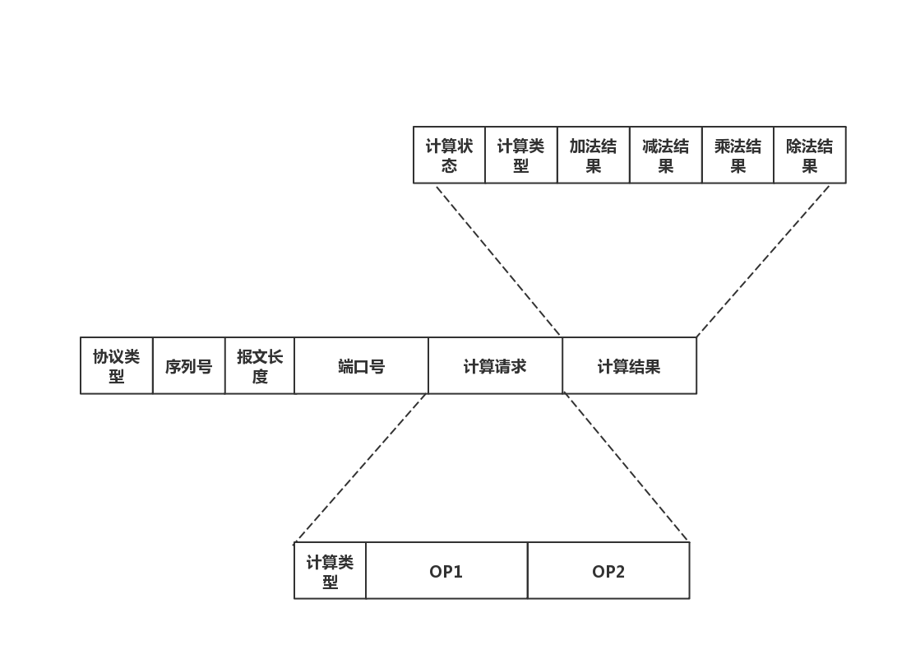
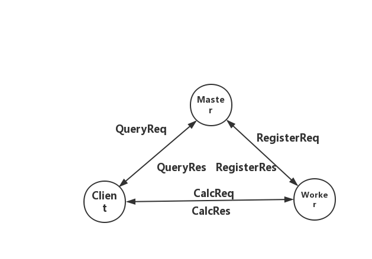

# 技术报告_homework2

> 组员:唐致远、马丁、胡嘉尚
> 

## 代码简略描述

我们最终选择使用golang语言进行并行开发，整个代码的组织结构如下：
.
├── bin 该目录存放最终编译的可执行文件，包括client、master和worker
│   ├── client
│   ├── master
│   └── worker
├── client 该目录存放client的代码实现文件
│   ├── client.go
│   └── clientNode.go
├── cmd  该目录存放c\m\w的调用脚本，用于编译最终的可执行文件
│   ├── client-driver
│   │   └── main.go
│   ├── master-driver
│   │   └── main.go
│   └── worker-driver
│       └── main.go
├── Makefile
├── master  该目录存放master的代码实现文件
│   ├── clientmanager.go
│   ├── master.go
│   └── workermanager.go
├── protos 该目录存放协议的具体实现
│   ├── message.pb.go
│   └── message.proto
├── README.md
├── utils  该目录存放基本的工具函数
│   └── utils.go
└── worker  该目录存放worker的代码实现文件
    ├── worker.go
    └── workerNode.go

## 协议

我们使用google protocal buffer 设计协议，具体的协议如下

其中，协议类型包括：
- REGISTER_REQ 用于W向M注册
- REGISTER_RES 用于注册的回馈
- QUERY_REQ C向M询问W的地址
- QUERY_RES query的返还值
- CALCULATE_REQ：计算请求
- CALCULATE_RES：计算结果

计算类型包括四种：
- int32
- int64
- float32
- float64

具体交互过程如下：

## 测试

1. 测试步骤如下：
- 启动master
- 启动三个worker
- 启动三个client
- client发送100w个请求包（随机生成四种类型，随机生成OP）
- worker返回测试结果，验证测试结果

2. 测试结果如下：
